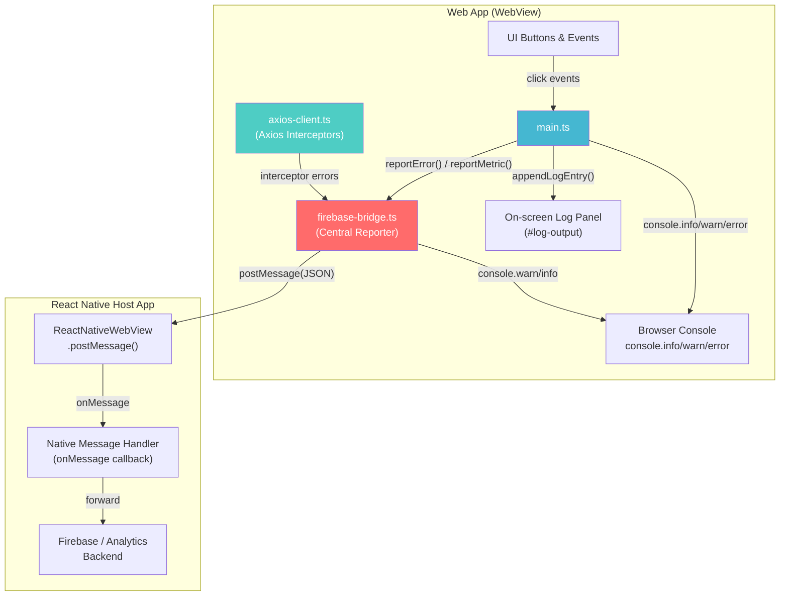
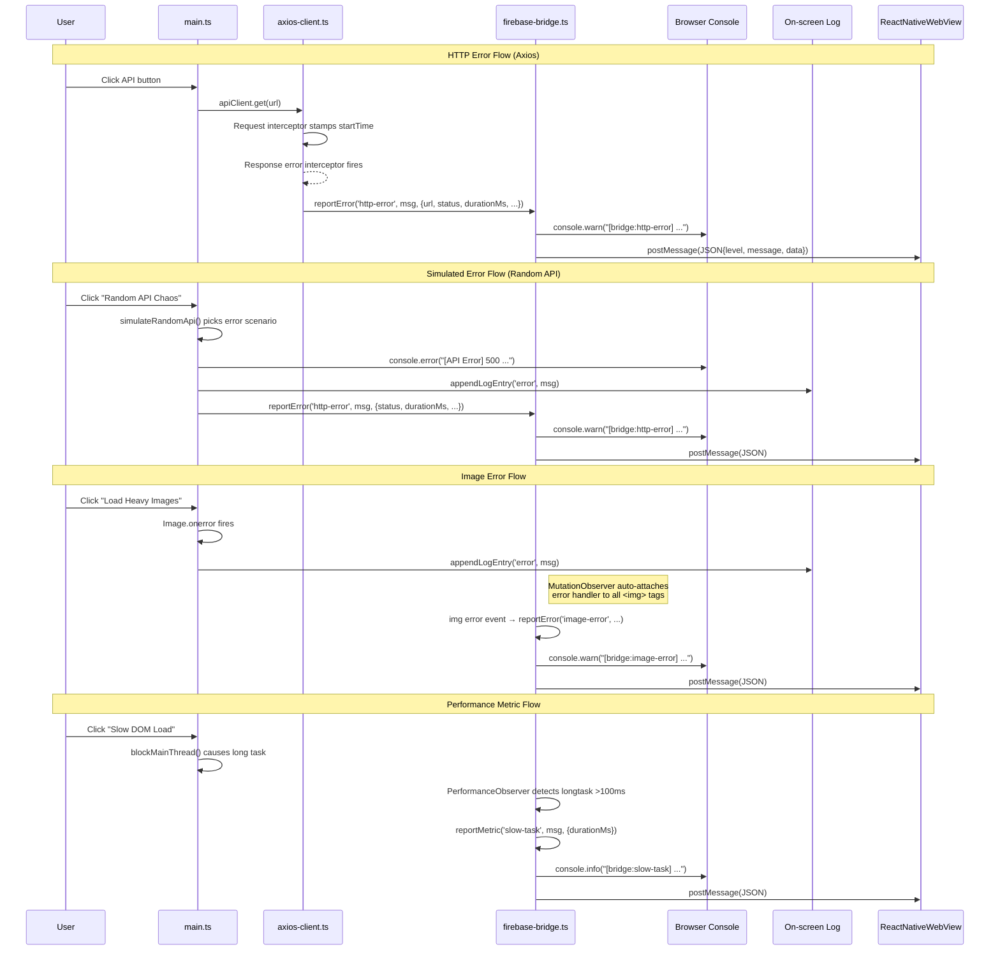

# Error & Logging Architecture

## Overview

This web app runs inside a React Native WebView and emits errors/logs through two parallel channels:
1. **Browser console** — standard `console.info/warn/error` for dev debugging
2. **Native bridge** — `ReactNativeWebView.postMessage()` to send structured JSON to the host app

All error reporting funnels through `firebase-bridge.ts`, which acts as the central reporting gateway.

---

## Architecture Diagram



---

## Error Flow Diagram



---

## Source Files

| File | Role |
|------|------|
| `src/firebase-bridge.ts` | Central error/metric reporter + native bridge |
| `src/axios-client.ts` | HTTP client with error/perf interceptors |
| `src/main.ts` | UI logic, event handlers, simulated scenarios |

---

## Reporting Functions

### `reportError(level, message, data?)`
**File:** `src/firebase-bridge.ts:22`

Sends error-level events. Used for:
- HTTP errors (4xx/5xx)
- Network errors (no response)
- Image load failures

**Output channels:**
- `console.warn("[bridge:{level}] {message}")`
- `ReactNativeWebView.postMessage(JSON.stringify({level, message, data}))`

### `reportMetric(level, message, data?)`
**File:** `src/firebase-bridge.ts:27`

Sends performance/metric events. Used for:
- Slow HTTP responses (>1000ms)
- Long tasks detected by PerformanceObserver (>100ms)

**Output channels:**
- `console.info("[bridge:{level}] {message}")`
- `ReactNativeWebView.postMessage(JSON.stringify({level, message, data}))`

---

## Error Types & Levels

| Level | Source | Trigger | Data Fields |
|-------|--------|---------|-------------|
| `http-error` | Axios interceptor / Random API sim | HTTP 4xx/5xx response | `url, method, status, statusText, durationMs, responseBody` |
| `network-error` | Axios interceptor | No server response (timeout, DNS, etc.) | `url, method, errorMessage` |
| `image-error` | MutationObserver (firebase-bridge) | `` element fails to load | `url` |
| `slow-response` | Axios interceptor / Random API sim | HTTP response >1000ms | `url, method, status, durationMs` |
| `slow-task` | PerformanceObserver (firebase-bridge) | Main thread blocked >100ms | `durationMs, startTime` |

---

## Native Bridge Protocol

**Message format** sent via `ReactNativeWebView.postMessage()`:

```json
{
  "level": "http-error",
  "message": "GET /api/users → 500 Internal Server Error",
  "data": {
    "url": "/api/users",
    "method": "GET",
    "status": 500,
    "statusText": "Internal Server Error",
    "durationMs": 1234,
    "responseBody": "{\"error\":\"Internal error\"}"
  }
}
```

The native React Native app receives this in its `onMessage` callback and can forward to Firebase Crashlytics, analytics, or any backend.

---

## Automatic Detection (No User Action Required)

The `initBridge()` function sets up two passive observers:

1. **MutationObserver** — watches DOM for any new `` elements, attaches error handlers automatically
2. **PerformanceObserver** — monitors `longtask` entries (>100ms main-thread blocks), reports as metrics

These run continuously after page load without user interaction.

---

## On-Screen Log Panel

In addition to bridge reporting, `main.ts` maintains a visible log panel (`#log-output`) using `appendLogEntry()`. This is purely for debugging/demo purposes and shows timestamped entries with color-coded levels (info/warning/error). Not sent to native.

---

## Data Flow Summary

```
User Action
    │
    ├── console.info/warn/error ──→ Browser DevTools
    │
    ├── appendLogEntry() ──→ On-screen Log Panel (visual only)
    │
    └── reportError() / reportMetric()
            │
            ├── console.warn/info ──→ Browser DevTools (prefixed [bridge:*])
            │
            └── postMessage(JSON) ──→ ReactNativeWebView
                    │
                    └── onMessage callback ──→ Firebase / Analytics
```
